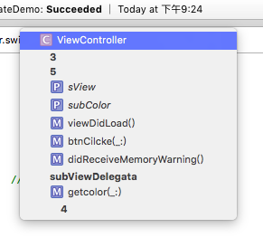

## 这是一个 V to C (Delegate)的例子
	使用小技巧,我在每部操作都加了MARK 可以在上边的这个地方跳转

Delegate一共5步

1. 创建一个protocol[^1]，其中包括了View需要controller帮他做的事情  （比如要要要滚动到这，获取数据）
2. 在view中创建属性 delegate 或者是 dataSource  ，这个属性到类型是你的代理协议（属性设置称weak）
3. 使用这个代理去实现所有的代理，它将发送一个消息给protocol，我是否要滚动到这个点？。所有遵从这个protocol都可以给这个属性赋值
4. 在controller中声明实现这个protocol
5. controller会将自己作为代理对象，他会设置这个视图的代理属性为自身
6. 实现protocol中的所有方法

[^1]:protocol:协议是为方法、属性等定义一套规范，没有具体的实现。