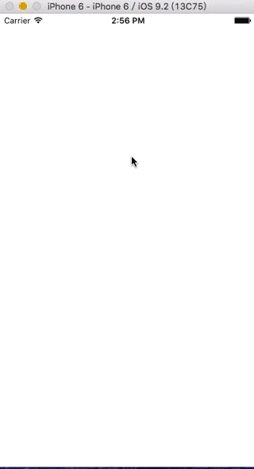

#TODO:
-	自定义下拉刷新
-	collection
-	animation

###[Animation](./Animation)
登录界面两个textField划入

###[DropGame](./DropGame)
dynamicAnimator

------------
###[ActionSheet&Alert](./ActionSheet&Alert)
ActionSheet和alert的练习

###[Start-Dev-iOS-Apps-09](./Start-Dev-iOS-Apps-09)
ios官方文档中的DEMO最终版 
###[DelegateDemo](./DelegaDemo)
有关代理的练习

###[iOS-StackViewStarterProject-master](./iOS-StackViewStarterProject-master)

对stackView的练习,加入了一个飞入特效

###[getData](./getData)
获取网络数据

###[TextField Delegate](./TextField Delegate)

